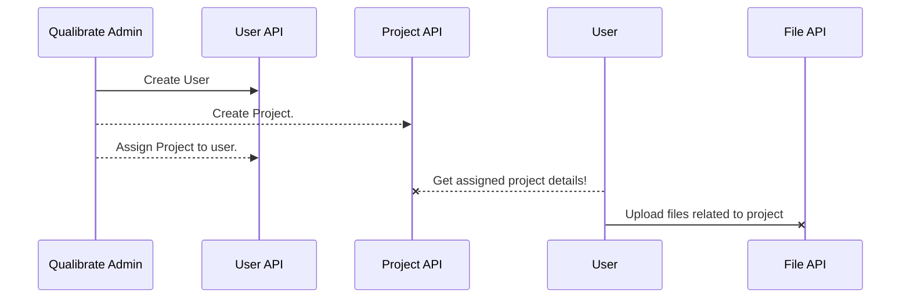

#API implementation

#Qualibrate Java API 
This project is implementation of python based qualibrate APIs. This project covers following 3 entities.

 - User Entity 
 - Project Entity 
 - Files Entity (File Upload)

These REST APIs are written in Java 8 using Spring Boot. For API documentation Swagger is used. Test cases are implemented using Junit and are executed with every build. For testing purpose H2DB is used with 'test' profile. 
### Technology/Application Stack

 -Language : Java 8
 - Frameworks :
	 - Spring Boot (4.2.4.RELEASE) : To implement web services.
	 - Swagger (2.4.0) : For API documentation purpose.
	 - lombok (1.18.8) : To keep code neat and clean. To generate access methods using java agent.
 - Gradle plugins:
	 - Checkstyle: Plugin is used to maintain code formatting and validate     syntax such as CamelCase, spaces.
	 - Doker: Plugin is used to create docker image of spring boot application.
	 - FindBugs: Plugin is used to detect errors in code such as memory leaks, null references, possible null pointer exceptions etc.
	 - Zip: Plugin is used to build beanstalk zip file/build packages.

## High Level Design Approach

APIs are built by considering following requirements.

 - **Lines of code and template based design** :  Reflection and java 8 streaming apis are heavily used in code to generalize things and to reduce lines of code. EntityToDTO converter is built using java reflection and is generalized to convert entity based on type. This is template based design used to generalize common behavior across application entities.
 - **Security**: Api security is must. Added basic authentication support in API and configured firewall in application. To maintain security one can configure firewall rules to restrict URL access by configuring URL pattern rules in firewall. Role based access is maintained using Spring boot role based authentication and authorization mechanism at method level.
 - **CORS** :  Cross Origin and Resource Sharing feature is configured for globally (all controllers and methods). To configure domain please specify allowed.origin environment variable while booting application. Please refer to **Environment Variables** section for more details.
 - **CICD** : Travis is used to build application and deploy on beanstalk.
 - **Application Monitoring** : Portainer is used to monitor docker image.
 - **Large File Upload Support**: Multipart upload is enabled and Input streams are used to handle to support large file upload. File upload size can be managed using "file-size-threshold" in KB (to manage multiparts) and maz-file-size (in MB) and max-request-size (in MB).
 - **Error code standardization** : API responses and error codes are standardized across application by considering various possible failure scenarios. Please refer to **Error Code details** section for more details.

## Environment Variables

 - SPRING_DATASOURCE_USERNAME : Database user name
 - SPRING_DATASOURCE_PASSWORD : Database password
 - FILE_UPLOADDIR : Upload file directory
 - ALLOWED_ORIGINS: CORS origins (http://localhost:8080)
 - SPRING_PROFILES_ACTIVE : (Possible values 'local', 'production', 'test', 'aws' 
 - SPRING_SERVLET_MULTIPART_ENABLED : true/false
 - SPRING_SERVLET_FILE-SIZE-THRESHOLD : 2KB
 - SPRING_SERVLET_MAX-FILE-SIZE : 200MB
 - SPRING_SERVLET_MAX-REQUEST-SIZE : 250MB

## Error Codes and API responses

 - ISE_001 : To indicate internal server error /  unhandeled exception scenarios.
 - VE0001 : To indicate validation errors with request.
 - NF0001 : To indicate Resource Not Found Exception.
 - FNS_0001 : Format not supported
 - Entity Specific error codes
	 - User API : 
		 - USRE_001 : User Already Exists
		 - USRE_002: User Entity Not Found
		 - UEC_003 : Unauthorized access
	 - Project Entity
		 - PRJ_001 : Project already exists.
		 - PRJ_002 : Project details not found.	

# Build Information

Gradle is used to build and package application. It also runs checkstyle, findbugs and runs test cases in every build.

Run Gradle clean build task to generate beanstalk zip, docker image and spring boot jar.
Below are more details about tasks.

Application tasks
-----------------
bootRun - Runs this project as a Spring Boot application.

Build tasks
-----------
assemble - Assembles the outputs of this project.
bootJar - Assembles an executable jar archive containing the main classes and their dependencies.
build - Assembles and tests this project.
buildDependents - Assembles and tests this project and all projects that depend on it.
buildNeeded - Assembles and tests this project and all projects it depends on.
classes - Assembles main classes.
clean - Deletes the build directory.
jar - Assembles a jar archive containing the main classes.
testClasses - Assembles test classes.
**buildDocker**: build docker image
**beanstalkZip:** Build beanstalk image.

Build Setup tasks
-----------------
init - Initializes a new Gradle build.
wrapper - Generates Gradle wrapper files.

Documentation tasks
-------------------
asciidoctor - Converts AsciiDoc files and copies the output files and related resources to the build directory.
javadoc - Generates Javadoc API documentation for the main source code.

Help tasks
----------
buildEnvironment - Displays all buildscript dependencies declared in root project 'qualibrate-api-challange'.
components - Displays the components produced by root project 'qualibrate-api-challange'. [incubating]
dependencies - Displays all dependencies declared in root project 'qualibrate-api-challange'.
dependencyInsight - Displays the insight into a specific dependency in root project 'qualibrate-api-challange'.
dependentComponents - Displays the dependent components of components in root project 'qualibrate-api-challange'. [incubating]
help - Displays a help message.
model - Displays the configuration model of root project 'qualibrate-api-challange'. [incubating]
projects - Displays the sub-projects of root project 'qualibrate-api-challange'.
properties - Displays the properties of root project 'qualibrate-api-challange'.
tasks - Displays the tasks runnable from root project 'qualibrate-api-challange'.

Reporting tasks
---------------
projectReport - Generates a report about your project.

Verification tasks
------------------
check - Runs all checks.
jacocoTestCoverageVerification - Verifies code coverage metrics based on specified rules for the test task.
jacocoTestReport - Generates code coverage report for the test task.
test - Runs the unit tests.
Build : Following tasks are configured in default build process.

## Activity Diagrams

Below is a activity diagram for API usage.


API flow chart:

```mermaid
graph LR
A[Spring Security Filter] -- security checks --> B(Basic Auth)
B --> C(CORS Filter)
C --> D(Controller Mappings)
D --> E(Controller)
E --> F(Response)
F --> C

